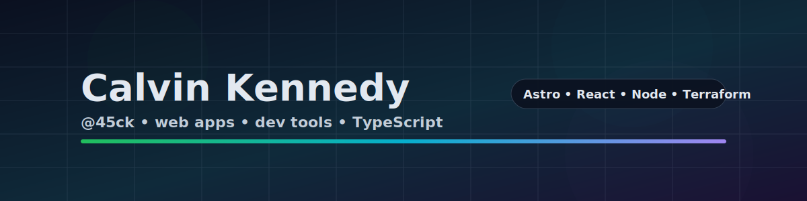

<!--
This README is generated from README.template.md by scripts/update-readme.mjs
Manual edits to README.md will be overwritten.
-->

  

## 👋 Hey, I'm Calvin (@45ck)

I build **production-grade web apps** and **developer tools** with a focus on clean architecture, DX, and shipping.

### 🔗 Links

- 🌐 Portfolio: https://calvinkennedy.com
- 🧠 VibeCoord: https://vibecord.dev
- ✉️ Email: hello@calvinkennedy.com

### 🧰 Toolbox

- 🟦 TypeScript, Node.js
- ⚛️ React, Astro, Tailwind
- 🗄️ Postgres (Neon), Drizzle
- 💳 Stripe, 🔐 Clerk, ✉️ Resend
- 🧱 Terraform, AWS

---

## 🚀 Active Public Repos (last 3 months)

{{ACTIVE_REPOS}}

## 🗃️ Inactive Public Repos (3+ months)

{{INACTIVE_REPOS}}

---

_Last updated: {{UPDATED_AT}}_

